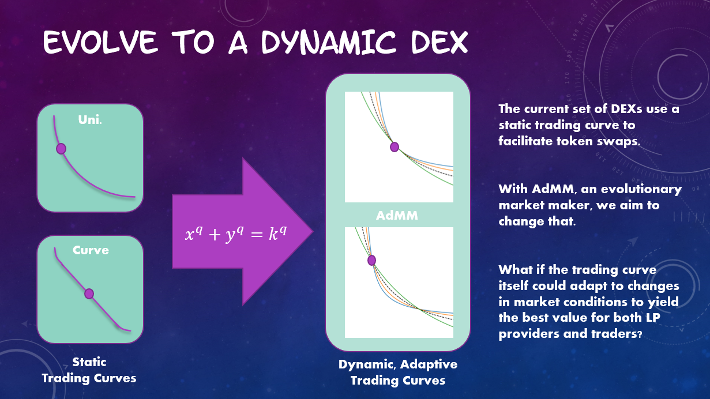

# ChainlinkHackathon2022

Chainlink Hackathon project 2022 -- Adaptive Market Maker

Check out our interactive app [here](https://chainlink-hackathon2022-frontend.vercel.app)

## Adaptive Trading Curves

A variation on the Constant-Product Market Maker (CPMM) theme, this project will prototype an exchange with tunable trading curves.

That is, based on different market conditions, the exchange will alter the functional form of the bonding curve to more closely approach a linear curve, such as is done for stablecoin projects like Curve Finance, or to more closely approach the constant product xy=constant curve, or to more closely approach a function with even more curvature, as might be more appropriate for highly leveraged or extremely volatile assets.

## Contracts

I coded the primary exchange, swap, and tunable bonding curve contracts in solidity. The contract code and hardhat deployment can be found in: 

[https://github.com/giddyphysicist/ChainlinkHackathon2022_hardhat](https://github.com/giddyphysicist/ChainlinkHackathon2022_hardhat)

## Front-End

I built a simple Web3 front-end using Next.js, some Moralis hooks, and web3uikit, based heavily off Patrick Collins' excellent tutorials!

Here is the interactive [app](https://chainlink-hackathon2022-frontend.vercel.app)

And here is the repo containing the front-end code base:

[https://github.com/giddyphysicist/ChainlinkHackathon2022_Frontend](https://github.com/giddyphysicist/ChainlinkHackathon2022_Frontend)

## Next Steps

### Chainlink Interfaces

I plan on leveraging Chainlink price oracles in tandem with Chainlink Keepers in order to regularly check the changes of market prices over a given period, and then automatically adjust the bonding curve to optimize for different trading and LP positions.

### Feasibility Studies

I did some initial tests and analyses using in python, and displayed the use cases of such an exchange. But I'd like to do some more extensive studies to adjust the meta-parameters.
